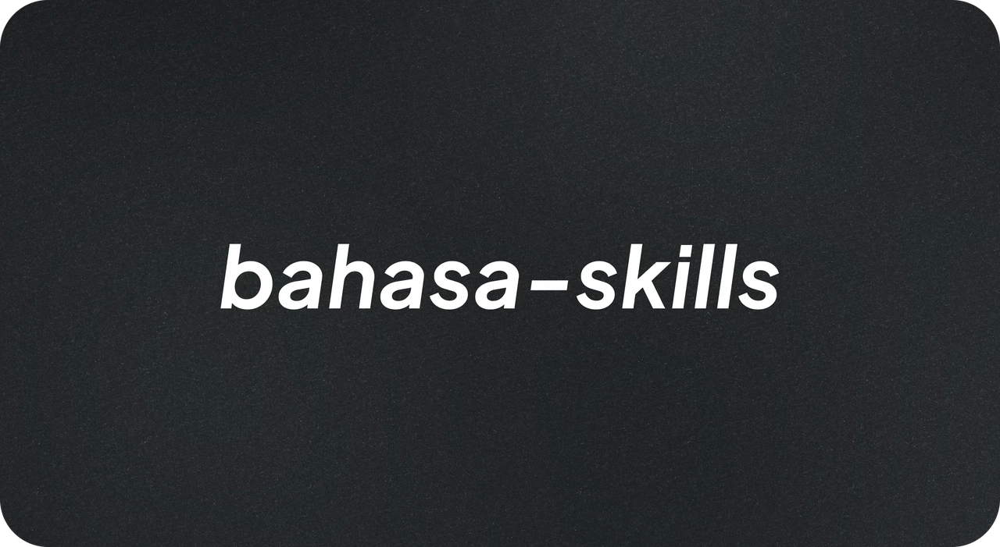

<p align="center">
  
</p>

# bahasa-skills

Paket skill Claude untuk menulis bahasa Indonesia yang bermutu: diksi tepat, kaidah benar, ragam sesuai situasi, dan **bebas AI slop** (frasa klise, struktur generik, serta kosakata khas keluaran mesin).

Repo: https://github.com/alvinindra/bahasa-skills

## Kenapa paket ini ada

Dua masalah yang sama-sama merusak tulisan berbahasa Indonesia buatan AI:

1. **AI slop.** Pembuka "Di era digital yang serba cepat ini…", penutup "Semoga bermanfaat!", kata "hiruk pikuk", "lanskap", "krusial", paralelisme "bukan hanya X, tetapi juga Y", em dash di mana-mana, emoji sebagai butir daftar. Pembaca Indonesia sudah mengenali pola-pola ini sebagai tanda tulisan mesin.
2. **Pilihan bahasa yang meleset.** Kata nonbaku di teks resmi, bahasa kaku di caption santai, sapaan "Anda" dan "kamu" bercampur, istilah asing padahal ada padanan yang lazim, atau sebaliknya: padanan kaku ("tetikus", "peladen") yang justru mengasingkan pembaca.

Paket ini menjawab keduanya dengan kerangka Ivan Lanin: tulisan harus **benar** (sesuai kaidah) sekaligus **baik** (sesuai konteks), dan "baku tak mesti kaku".

## Sebelum dan sesudah

Prompt sama, model sama (Sonnet 5); yang berbeda hanya skill terpasang atau tidak. Dua cuplikan dari [CONTOH.md](CONTOH.md); kutipan ❌ ditampilkan apa adanya sebagai bukti.

**Caption Instagram** untuk pengumuman fitur QRIS aplikasi kasir "Kasirin" (merek fiktif bahan uji):

❌ Tanpa skill, 5 temuan: em dash gaya, hook yang bisa menempel pada pengumuman apa pun, klaim melebihi brief, penutup tripel, sembilan hashtag.

> Buat kamu pemilik warung, kedai kopi, sampai toko kelontong—ini kabar yang kamu tunggu-tunggu 👀 […] Usaha lancar, transaksi gampang, cuan tetap utuh 💸
>
> `#Kasirin #KasirinID #AplikasiKasir #QRIS #UMKM #WarungNaikKelas #KedaiKopi #TokoKelontong #UsahaDigital`

✅ Dengan skill, nol temuan: hook 83 karakter yang spesifik masalah, klaim berpagar brief, satu CTA, empat hashtag.

> Ada pembeli di warungmu pegang HP, bukan dompet. "Bisa bayar QRIS?" Kamu jawab apa?
>
> Sekarang jawabannya gampang: bisa.
> Kasirin sekarang terima pembayaran QRIS, langsung dari aplikasi yang biasa kamu pakai buat catat transaksi. Nggak perlu mesin tambahan, nggak perlu pasang aplikasi lain.
>
> Biaya transaksinya gratis sampai 31 Oktober 2026: uang dari tiap transaksi QRIS masuk utuh ke kamu, nggak kepotong sepeser pun.
>
> Buka aplikasi Kasirin, lalu aktifkan QRIS di menu pembayaran sekarang.
>
> `#kasirin #umkmnaikkelas #qriswarung #kasiraplikasi`

**Judul artikel SEO** untuk kata kunci "cara mengatur keuangan rumah tangga":

> ❌ Cara Mengatur Keuangan Rumah Tangga dengan Gaji UMR Pakai Rumus 50/30/20

72 karakter (terpotong di hasil pencarian), Title Case.

> ✅ Cara mengatur keuangan rumah tangga gaji UMR: rumus 50/30/20

60 karakter persis, kata kunci di depan, kapital hanya di kata pertama.

Dari sepuluh percobaan lintas model dengan prompt caption yang sama: Haiku 4.5 **dengan** skill (2 temuan) mengalahkan Opus 5 **tanpa** skill (7 temuan). Aturan tertulis lebih menentukan daripada ukuran model. Keluaran mentah, temuan pemeriksaan, token, dan metodenya ada di [CONTOH.md](CONTOH.md).

## Isi paket

| Berkas | Untuk apa |
|---|---|
| [SKILL.md](SKILL.md) (root) | **Pemandu arah** untuk instalasi klon (Cara 2): membaca kebutuhan dari prompt pengguna, lalu mengarahkan ke aturan inti dan skill kategori yang tepat. Pada instalasi plugin, peran ini dijalankan description tiap skill. |
| [bahasa-inti](skills/bahasa-inti/SKILL.md) | Aturan dasar semua tulisan: larangan anti-slop, pemilihan ragam, kata baku, padanan istilah, EYD V. Skill lain menumpuk di atasnya. |
| [bahasa-marketing](skills/bahasa-marketing/SKILL.md) | Materi pemasaran: caption media sosial (Instagram, TikTok, X, LinkedIn, Facebook), iklan, email, tagline, brand voice. |
| [bahasa-website](skills/bahasa-website/SKILL.md) | Teks situs dan antarmuka: UX writing, microcopy, tombol, pesan galat, halaman landing, produk, tentang kami, FAQ. |
| [bahasa-seo](skills/bahasa-seo/SKILL.md) | Konten organik: riset kata kunci, search intent, title dan meta description, struktur heading, standar helpful content Google. |
| [bahasa-peneliti](skills/bahasa-peneliti/SKILL.md) | Karya ilmiah: ragam akademik, kalimat efektif, struktur IMRaD, abstrak, dan larangan mutlak referensi fiktif. |
| [sumber/](sumber/) | Dokumentasi semua rujukan riset yang dipakai menyusun paket ini, beserta catatan mutu sumbernya. |
| [CONTOH.md](CONTOH.md) | Bukti sebelum dan sesudah: 16 percobaan nyata membandingkan keluaran tanpa vs dengan skill lintas model (Haiku, Sonnet, Opus, Fable), lengkap dengan temuan pemeriksaan, token, dan durasinya. |

## Instalasi

**Cara 1: plugin Claude Code** (disarankan; skill terpicu otomatis lewat description masing-masing):

```bash
claude plugin marketplace add alvinindra/bahasa-skills
```

lalu di sesi Claude Code jalankan `/plugin install bahasa-skills@bahasa-skills`.

**Cara 2: klon sebagai satu skill.** SKILL.md di root menjadi pemandu yang memuat aturan kategori sesuai prompt:

```bash
git clone https://github.com/alvinindra/bahasa-skills.git "$HOME/.claude/skills/bahasa-skills"
```

**Cara 3: salin per kategori.** Salin folder yang dibutuhkan dari `skills/` ke `.claude/skills/` proyek atau `~/.claude/skills/`. Sertakan selalu `bahasa-inti`, karena skill lain merujuk berkasnya.

## Cara kerja

Setiap skill memakai protokol tiga langkah yang sama:

1. **Sebelum menulis**: tentukan pembaca, ragam, medium, dan satu pesan utama.
2. **Saat menulis**: patuhi larangan keras (daftar frasa terlarang, kaidah diksi, aturan kategori).
3. **Sesudah menulis**: jalankan pemeriksaan wajib. Pindai frasa terlarang, kata nonbaku, dan struktur slop; uji spesifisitas; uji baca nyaring. Teks yang belum lolos tidak boleh diserahkan.

## Dasar rujukan

Seluruh sumber terdokumentasi di [sumber/](sumber/). Garis besarnya:

- Ivan Lanin: kerangka "baik, benar, luwes", lima ragam formalitas, *Xenoglosofilia: Kenapa Harus Nginggris?* (2018), *Recehan Bahasa* (2020), Narabahasa.
- EYD Edisi V (ejaan.kemdikbud.go.id), KBBI Daring (kbbi.kemdikbud.go.id), PASTI (pasti.kemdikbud.go.id).
- Wikipedia *Signs of AI writing* dan kajian *excess vocabulary* (Kobak dkk., Science Advances 2025), diadaptasi ke penanda slop berbahasa Indonesia.
- Praktik industri Indonesia: prinsip UX writing Gojek/tiket.com/Tokopedia, Etika Pariwara Indonesia (aturan superlatif), dokumen resmi Google Search Central (helpful content, E-E-A-T).

## Struktur

```
bahasa-skills/
├── SKILL.md                  # pemandu arah (router) untuk semua tugas bahasa Indonesia
├── .claude-plugin/           # manifest plugin & marketplace
├── assets/                   # thumbnail repo
├── skills/
│   ├── bahasa-inti/          # SKILL.md + references/ (frasa terlarang, kata baku, padanan, EYD)
│   ├── bahasa-marketing/     # SKILL.md + references/ (media sosial, copywriting)
│   ├── bahasa-website/       # SKILL.md + references/ (UX writing, halaman situs)
│   ├── bahasa-seo/           # SKILL.md + references/ (riset kata kunci, on-page)
│   └── bahasa-peneliti/      # SKILL.md + references/ (kalimat akademik, struktur & sitasi)
├── sumber/                   # dokumentasi rujukan riset
├── CONTOH.md                 # bukti sebelum-sesudah lintas model
└── README.md
```

## Pemeliharaan

Daftar kata baku dan padanan istilah mengikuti KBBI/PASTI per Agustus 2026. Jika ragu pada satu lema, rujukan akhirnya selalu kbbi.kemdikbud.go.id, bukan daftar di repo ini.
